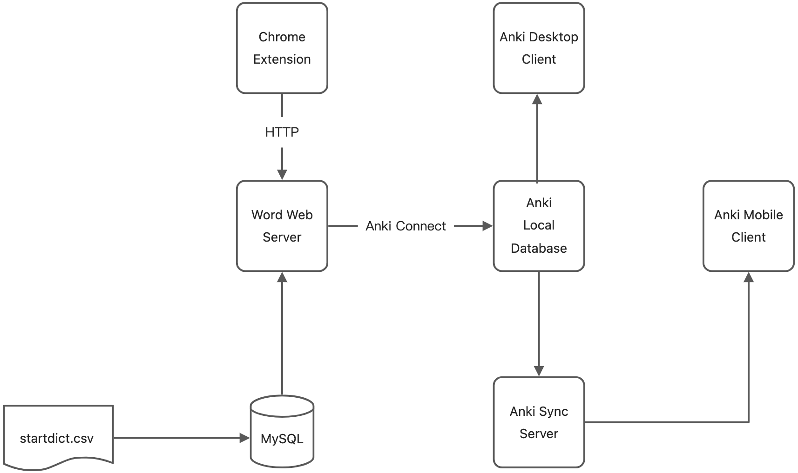
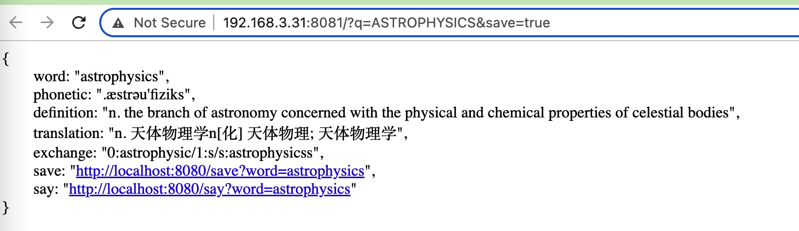

# word

词典 + 背单词
免费, self-hosting, 极快


## Anki

本项目生词本功能用 [Anki](https://apps.ankiweb.net/) +
[Anki Connect](https://ankiweb.net/shared/info/2055492159) 实现
手机端用 [AnkiDroid](https://play.google.com/store/apps/details?id=com.ichi2.anki)

### Anki Connect 配置

<https://foosoft.net/projects/anki-connect/#deck-actions>

```shell
defaults write net.ankiweb.dtop NSAppSleepDisabled -bool true
defaults write net.ichi2.anki NSAppSleepDisabled -bool true
defaults write org.qt-project.Qt.QtWebEngineCore NSAppSleepDisabled -bool true
```

### TTS 配置

<https://github.com/ankidroid/Anki-Android/wiki/FAQ#tts--text-to-speech-is-not-speaking>

```html
{{Front}}

<div id="anki_tts">
  {{tts en_US voices=Apple_Samantha,Microsoft_Zira speed=1.0:Front}}
</div>

<div id="ankidroid_tts" style="display:none;">
  <tts id="tts_tag" service="android" voice="en_US">{{Front}}</tts>
</div>

<script>
  if (document.documentElement.classList.contains("android")) {
    document.getElementById("anki_tts").innerHTML = "";
  } else {
    document.getElementById("ankidroid_tts").innerHTML = "";
  }
</script>
```

## MySQL

本项目主要用到了 [ECDICT](https://github.com/skywind3000/ECDICT) 作为词典
解压项目的 stardict.7z, 得到 stardict.csv, 之后将 CSV 导入 MySQL
推荐用 [dbeaver](https://github.com/dbeaver/dbeaver)

## DDL

```roomsql
-- word.stardict definition

CREATE TABLE `stardict` (
  `id` int NOT NULL AUTO_INCREMENT,
  `word` varchar(256) CHARACTER SET utf8mb4 COLLATE utf8mb4_0900_ai_ci NOT NULL,
  `sw` varchar(256) CHARACTER SET utf8mb4 COLLATE utf8mb4_0900_ai_ci DEFAULT NULL,
  `phonetic` varchar(1000) CHARACTER SET utf8mb4 COLLATE utf8mb4_0900_ai_ci DEFAULT NULL,
  `definition` text,
  `translation` text,
  `pos` varchar(256) CHARACTER SET utf8mb4 COLLATE utf8mb4_0900_ai_ci DEFAULT NULL,
  `collins` smallint DEFAULT '0',
  `oxford` smallint DEFAULT '0',
  `tag` varchar(64) DEFAULT NULL,
  `bnc` int DEFAULT NULL,
  `frq` int DEFAULT NULL,
  `exchange` text,
  `detail` text,
  `audio` text,
  PRIMARY KEY (`id`),
  KEY `sw` (`sw`,`word`),
  KEY `collins` (`collins`),
  KEY `oxford` (`oxford`),
  KEY `tag` (`tag`),
  KEY `stardict_word_IDX` (`word`) USING BTREE
) ENGINE=InnoDB AUTO_INCREMENT=3402565 DEFAULT CHARSET=utf8mb4 COLLATE=utf8mb4_0900_ai_ci;\
```

## chrome 插件

提供了划词右键查词的功能,安装方法是访问
chrome://extensions
安装本项目的 chrome 目录




## Anki 技巧

1. 推荐用电脑, 可以用键盘快捷键

- 空格 看解析
- 1 again 这个单词不认识，或者认识错了
- 2 hard 想了一会儿想出来了
- 3 good 认识
- 4 easy 非常认识

不建议用 easy, easy 的意思是重复时间过短了。建议都用 good
如果一开始用 easy, 可以在 browse 页面选中单词, 右键 `forget`
这样会重置单词的复习时间，被视为新的单词

在 deck 的 options 里可以选每天新学的单词数量

参考 <https://docs.ankiweb.net/studying.html>

可以使用 [2021 scheduler](https://faqs.ankiweb.net/the-2021-scheduler.html)
在 Preferences, Scheduling 里, 选 V3 Scheduler. 新版的卡片调度器.
